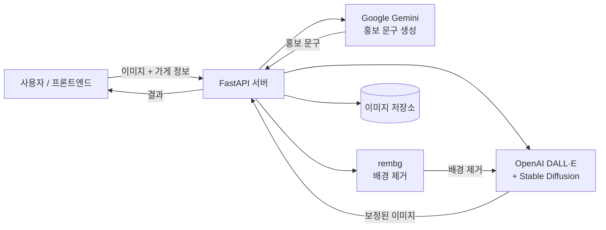

# DailyAlley · Promo & Ad Image Generator

> 소상공인을 위한 AI 기반 **사진 보정 + 홍보 문구 생성** 백엔드 서비스
> 2025년 멋쟁이사자처럼 13기 해커톤 팀 **순대볶음** · AI 파트 담당

[](https://www.python.org/)
[](https://fastapi.tiangolo.com/)
[](https://www.docker.com/)
[](https://aws.amazon.com/ec2/)
[](https://deepmind.google/technologies/gemini/)
[](https://openai.com/)

---

## 프로젝트 개요

소상공인들은 온라인 홍보의 필요성을 알고 있지만, 전문 사진 편집이나 카피라이팅 역량 부족으로 실행에 어려움을 겪습니다.
**Promo & Ad Image Generator**는 AI를 활용해 **사진 보정 → 홍보 문구 생성**을 자동화하는 백엔드 서비스입니다.

| 항목 | 내용 |
|---|---|
| 참여 대회 | 2025년 멋쟁이사자처럼 13기 해커톤 |
| 팀명 | 순대볶음 |
| 서비스명 | DailyAlley |
| 본인 담당 | AI 백엔드 (FastAPI · 모델 연동 · 배포) |

---

## 핵심 기여

- **FastAPI 백엔드 설계 및 구현**
  REST API 설계, 라우팅 구조화, 주요 엔드포인트 (`/v1/generate-promo`, `/v1/outpaint`, `/v1/upload-store-images`) 구현
- **다중 AI 모델 파이프라인 구축**
  Google Gemini로 자연어 프롬프트 강화 → OpenAI DALL·E · Stable Diffusion Inpainting · rembg를 조합한 이미지 보정/배경 제거 파이프라인
- **AWS + Docker 배포**
  Amazon Linux 2023 위 Docker 컨테이너로 서비스 배포, `.env` 기반 환경 변수 관리, CORS 설정

---

## 시스템 아키텍처



---

## 주요 기능

### 1. AI 이미지 보정
음식 사진의 색감·구도를 자동으로 보정하고, `rembg`로 배경을 제거한 뒤 SNS 친화적인 구도로 재구성합니다.

### 2. 맞춤형 홍보 문구 생성
업로드된 이미지와 가게 정보를 기반으로 *"세련된"*, *"열정적인"*, *"고급스러운"* 등 톤 앤 매너를 반영한 홍보 문구를 생성합니다.

---

## API 엔드포인트

| 메서드 | 경로 | 설명 |
|---|---|---|
| `POST` | `/v1/upload-store-images` | 가게 원본 이미지 업로드 |
| `POST` | `/v1/outpaint` | 이미지 보정 및 배경 제거/재구성 |
| `POST` | `/v1/generate-promo` | 홍보 문구 생성 (이미지 + 가게 정보 입력) |

---

## 기술 스택

| 분류 | 사용 기술 |
|---|---|
| Language / Framework | Python · FastAPI · Uvicorn |
| AI / ML | Google Gemini · OpenAI DALL·E · Stable Diffusion Inpainting · rembg |
| Infra | Docker · AWS EC2 (Amazon Linux 2023) |
| 라이브러리 | python-dotenv · Pillow |

---

## 프로젝트 구조

```
.
├── app.py                     # FastAPI 앱 및 라우트 등록
├── config.py                  # 환경 변수 및 설정
├── utils.py                   # 공용 유틸 함수
├── routes_promo.py            # 홍보 문구 생성 라우트
├── routes_ad_image.py         # 이미지 가공 라우트
├── routes_upload_store.py     # 원본 이미지 저장 라우트
├── test.py                    # 테스트용 함수
├── Dockerfile                 # 도커 컨테이너 설정
└── requirements.txt           # 의존성 목록
```

---

## 실행 방법

### 1. 환경 변수 설정
프로젝트 루트에 `.env` 파일을 만들고 아래 값을 채워주세요.

```dotenv
GEMINI_API_KEY="자신의 Gemini API Key"
OPENAI_API_KEY="자신의 OpenAI API Key"
GEMINI_MODEL="gemini-1.5-flash"
```

### 2. 로컬 실행
```bash
pip install -r requirements.txt
uvicorn app:app --reload
```

### 3. Docker로 실행
```bash
docker build -t dailyalley-ai .
docker run -p 8000:8000 --env-file .env dailyalley-ai
```
